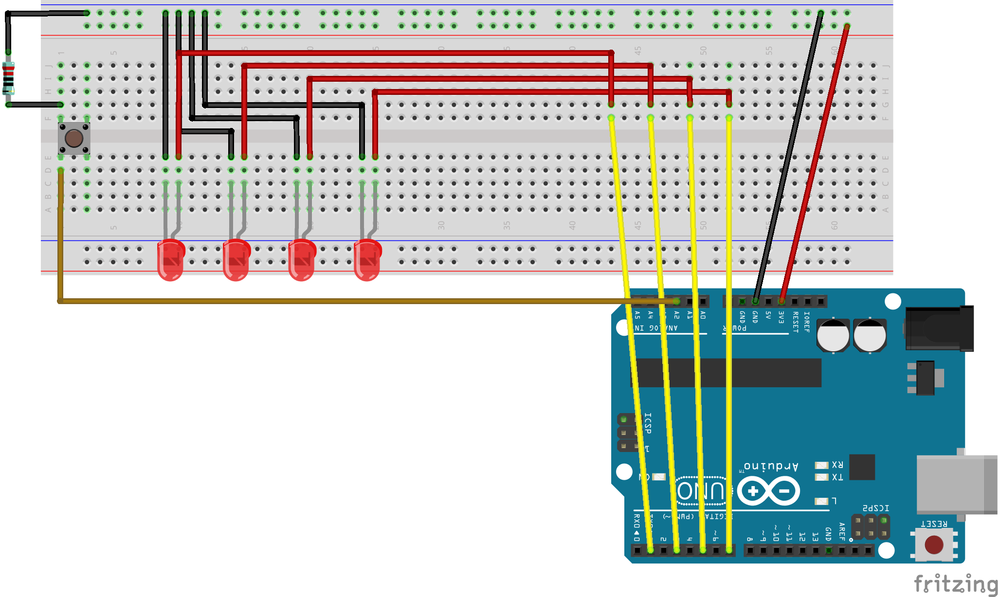

# avr-project-1-polyrhythmic-blinking

LEDS blink in polyrhythm. Wired on Arduino UNO but the code is written in C using AVR Libc.

## Wiring Diagram

## Video Demo

To do:
- Implement a piezo buzzer.
